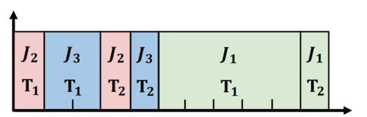
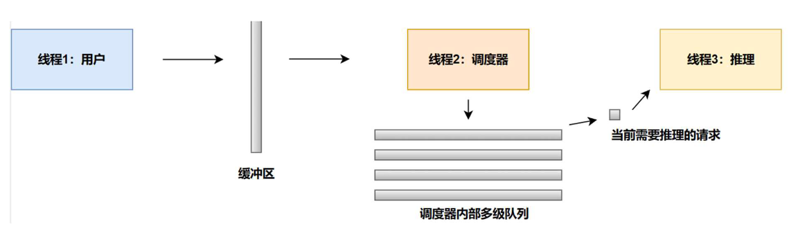

# skip-join-MLFQ:  
论文题目：Fast Distributed Inference Serving for Large Language Models  
原文链接：https://arxiv.org/abs/2305.05920  

&emsp;&emsp;参考论文4.1节中提出的skip-join MLFQ调度算法伪代码（论文第6页Algorithm 1），编程完成“skip-join MLFQ”调度策略仿真和实验（即不进行真实的推理，用sleep一段时间模拟推理过程；此处选用Python作为编程语言），并做实验观察调度器的性能。  
&emsp;&emsp;此调度算法关注的指标是平均任务完成时间average JCT，即所有请求从发送到收到结果的平均时间。如下图所示，J1,J2,J3三个请求同时到达，J2的JCT为4，J3的JCT为5，J1的JCT为11，他们的平均JCT为(4+5+11)/3=6.67。  
  
&emsp;&emsp;编写仿真需要使用多线程。参考经典的Producer-Consumer模型，我们共需要3个线程，简化的流程图如下图所示：  
  
1. 线程1：用于发送推理请求的用户线程，需要设置发送分布，发送速率等参数。在没有发送完设置的请求数量之前，用户线程将持续以用户设置的发送速率发送请求，发送的请求可以暂时放入缓冲区内等待调度器线程调度，也可自行设置其他的方法。

2. 线程2：（参考论文Algorithm 1实现）用于调度用户请求的调度器线程，需要参考论文中提出的schedule算法进行设计。多级队列包含三个参数，Queue_num, Quantum和Quantum_rate，Queue_num代表多级队列一共有多少级，即包含了多少个队列；Quantum需要设置为自回归阶段生成一个token的时间，而Quantum_rate则需要手动设置，它代表队列之间能够推理自回归阶段token数量的倍数。例如Quantum=1, Quantum_rate=2时，二级队列的Quantum即为2，代表在自回归阶段可以一次生成两个token，三级队列可以一次生成4个token。  
a.处理用户线程发送到缓冲区内的线程，根据请求提示词的长度决定将其分配到多级队列中的哪一级。请求需要放置在Quantum大于prefill阶段推理时长的最高优先级的队列。按照上文的例子，例如此刻到达的请求prefill阶段需要3ms，则需要将其放在Quantum为4的第三级队列。  
b.选中多级队列中第一个任务，将其放入推理线程中。  
c.为简化模拟过程，不考虑任务公平性。（即不考虑伪代码中Promote starved jobs部分）

3. 线程3：用于模拟推理过程的推理线程，使用time.sleep或chrono::high_resolution_clock模拟处理时间。（注：为了简化问题，仿真时同一时刻只提交推理一个任务即可，当该任务的quantum用完之后再安排下一个任务执行。可以在线程2中使用“xxxqueue.get()”阻塞等待线程3中的任务用完quantum并返回后，继续进行调度；线程3同样使用“xxqueue.get()”阻塞等待线程2提交的任务）  
a.放入推理线程的请求需要进行n次推理，也就是进行了n次迭代，生成了n个token。设x为当前队列的级数，n为Quantum_rate的x-1次方。如果该请求未达到它所需要的迭代次数，需要将其放入调度器的多级队列中。此时请求需要降级至下一级队列。

# Todo list:  
## 必做任务：
1. 实验1：根据实现的算法，复现论文Figure 6(c) skip-join MLFQ调度示意图（即第一张示例图）的调度过程，验证复现算法的正确性。
2. 实验2：以附录B中的数据集作为输入，记录调度输出结果、每个任务的JCT以及总平均JCT。

## 附加题：
1. 分析本文所提出的“skip-join MLFQ”调度策略在不同输入输出特征下的性能：  
a.尝试不同的数据发送速率，不同的发送分布下本文提出方法的性能。 
b.改变多级队列中队列的数量，Quantum_rate，观察实验结果并分析该如何设置队列数量以及Quantum_rate？
2. 尝试实现FCFS(First Come First Serve, 先来先服务)的调度器，即对于到达调度器的请求，先到达的请求将会优先进行推理。并将FCFS的模拟调度结果与本文提出方法的模拟调度结果相比较。

